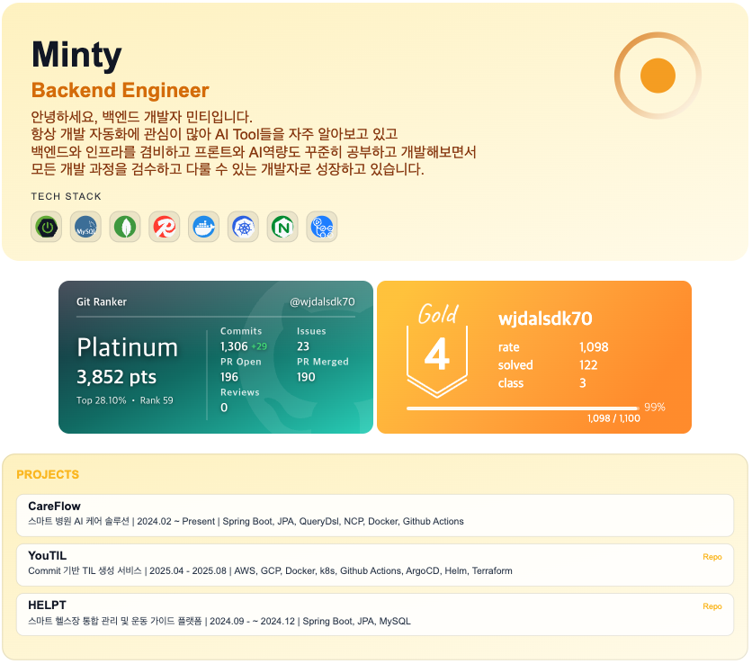

  

<h1 align="center">RuMe - README Card Builder</h1>

  GitHub 프로필용 카드, 배지, 프로젝트 섹션을 빠르게 만들고 복사할 수 있는 빌더입니다.

  <a href="https://lume-self.vercel.app/"><strong>Service 바로가기</strong></a>

  
  
  
  
  
  

  <a href="#introduction">Introduction</a> •
  <a href="#key-features">Key Features</a>

---

## Introduction

RuMe는 다음 흐름을 한 화면에서 처리합니다.

- 프로필 카드 생성 (`/api/card`)
- 프로젝트 카드 생성 (`/api/projects-card`)
- 배지 프리뷰 및 외부 배지 연결
- 최종 README Markdown 스니펫 복사

GitHub 로그인(NextAuth)을 통해 사용자별 입력값을 DB에 저장해 재사용할 수 있습니다.

---

## Key Features

  

<table>
  <tr>
    <td width="50%" valign="top">
      <h3>⚡ 실시간 카드 프리뷰</h3>
      
이름, 역할, 소개, 테마를 입력하면 SVG 카드가 즉시 갱신됩니다.

    </td>
    <td width="50%" valign="top">
      <h3>🎯 아이콘 기반 기술 스택</h3>
      
체크박스로 선택한 스택을 아이콘으로 렌더링합니다. (<code>simple-icons</code>)

    </td>
  </tr>
  <tr>
    <td width="50%" valign="top">
      <h3>🧩 프로젝트 카드 자동 생성</h3>
      
<code>프로젝트명|설명|기간|스택|repo|site</code> 형식 입력으로 프로젝트 카드를 생성합니다.

    </td>
    <td width="50%" valign="top">
      <h3>🔗 외부 배지 통합</h3>
      
Git Ranker 배지 URL과 solved.ac(백준 ID)를 함께 붙여 통합 프리뷰할 수 있습니다.

    </td>
  </tr>
  <tr>
    <td width="50%" valign="top">
      <h3>💾 사용자 설정 저장</h3>
      
로그인 사용자 기준으로 빌더 입력값을 저장하고 다음 방문 시 복원합니다.

    </td>
    <td width="50%" valign="top">
      <h3>📋 README 스니펫 복사</h3>
      
생성된 카드/배지 조합을 Markdown 스니펫으로 즉시 복사해 프로필에 적용할 수 있습니다.

    </td>
  </tr>
</table>
